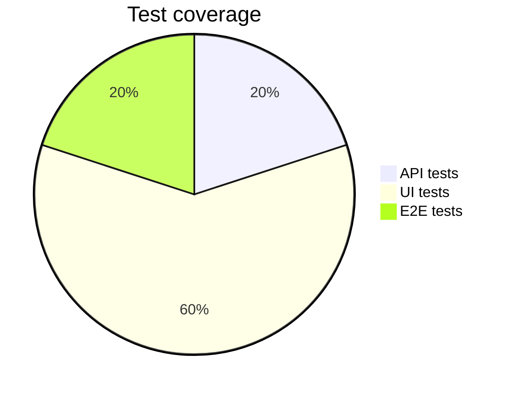
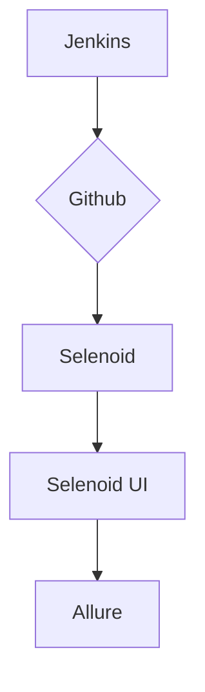

# Automatization framework to test Github servise 

<h3>Implemented Test Cases:</h3>
UI Tests web/ mobile platforms:

- [x]    Graphical user interface functionality (buttons, forms);
- [x]    Layout and element rendering;
- [x]    Client-side logic (e.g., field validation);

E2E Tests web platform:
- [x]    User scenaries of repository create;
- [x]    User scenaries of pull request create/ get/ update/ delete;

API Tests web platform:
- [x]    Issues CRUD operations;
- [x]    Data model and scheme validtion tests;



# Project implemented using:

**Frameworks:**
  - Pytest
  - Selenium
  - Selene
  - Appium
  - Allure
  - pydantic
  - Faker

**Instruments:**
  - Jenkins
  - Allure Testops
  - Selenoid
  - Selenoid-UI
  - BrowserStack
  - Docker

# Archtecture


# Local Setup

1. Clone the repository to your local machine using git clone
2. Create and activate a virtual environment

```bash
  python -m venv .venv
  source .venv/bin/activate # Linux/macOS  
  .\.venv\Scripts\activate   # Windows  
```

3. Install dependencies using pip

```bash
  pip install -r requirements.txt
```

4. To run tests locally, use:

```bash
  pytest .
```

5. Получение отчёта allure:

```bash
allure serve allure-results
```

### Remote Execution via Jenkins

## Build parameters 
*(parameters are not required to fill)*

* `ENVIRONMENT - defines the test environment (default: DEV)
* 'COMMENT' - build comment
* 'BROWSER_NAME' - browser for test execution (default: chrome)
* 'BROWSER_VERSION' - browser version (default: 100.0)

    
## Running Tests in Jenkins
1. Open the project
2. Select Build with Parameters
3. Modify build configuration if needed
4. Click Build
5. While tests are executing you can view this process in Selenoid UI

6. View results in Allure Report format
Allure Report
Overview

7. Also you can watch test execution records in Selenoid UI


TO-DO
- [x] Устойчивые локаторы
- [] Ленивые элементы с улучшенным описанием для лучших отчетов
- [x] Паттерн "Wait for" для более стабильных тестов
- [] Кастомные условия ожидания - расширение встроенных expected conditions
- [x] Абстрактный класс для пагеобжект
- [] Интеграция с Sentry для логирования ошибок
- [] Проксирование запросов для анализа сетевой активности
- [x] Генерация тестовых данных на лету с помощью Faker
- [x] Тестирование в разных ориентациях экрана
- [x] Интеграция с BrowserStack/Sauce Labs для облачного тестирования

- [x] PYTEST Advanced features
| pytest-xdist - для параллельного запуска тестов
| pytest-rerunfailures - для перезапуска упавших тестов
| pytest-html - для генерации HTML отчетов
| pytest-allure - для красивых Allure отчетов
| pytest-cov - для проверки покрытия кода тестами
